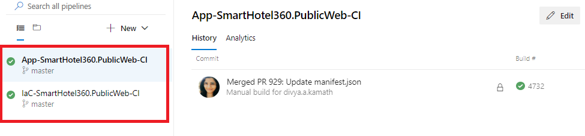

##  .Net Core 2.0 Web Application DevOps Accelerator

Using .Net Core 2.0 Web Application DevOps Accelerator, you can setup CI and CD pipeline for .Net Core 2.0 Web Apps.

Accelerator supports one click deployment, with minimum user inputs. Deployment can be triggered from any OS platform.

* [Get Started with Self-Service Portal](https://mep.avanade.com/docs/ssp/about/guide)

## What is SmartHotel360
SmartHotel360 is a fictitious smart hospitality company showcasing the future of connected travel.
Their vision is to provide:

-   *Intelligent, conversational, and personalized apps and experiences to guests*
-   *Modern workplace experiences and smart conference rooms for business travelers*
-   *Real-time customer and business insights for hotel managers & investors*
-   *Unified analytics and package deal recommendations for campaign managers.*

[Click here for more details](
https://github.com/Microsoft/SmartHotel360)

## Target Audience 

> **As Solution Architect or Sales team member,**

I want to setup a quick and robust demo for my clients. Which showcase the our DevOps capability, tools/ assets.

> **As a Project Manager,**

I want to quickly enable my team to start with development and deployment by following the DevOps pattern and practices.

> **As a New Member in the team,**

I want to learn the DevOps by deploying the Azure components (e.g. WebApps, VMs, Azure) using Azure DevOps.

## DevOps Implementation
-   Infrastructure as Code - ARM Templates
-   Build Automation - PowerShell, SonarQube - Code Analysis
-   Test Automation (Unit + Functional Test)
-   Release Automation - ARM Templates, CI CD JSON and PowerShell

> **Benefits**
-   Consistent, compliance and controlled based on the Organization policies
-   Cost reduction, better quality, and flexibility!
-   Never ship bad code!

## Prerequisite

>  Azure Subscription with rights to create ***Service Principal***

#### **How to Deploy SmartHotel360 using SSP**

The SmartHotel360 can be set up through the SSP by creating a new project using the subscription.
For creating project using SSP , refer "How to create new project" in the FAQ section. To set up SmartHotel360 for the created project refer below :

#### **Steps to Set Up SmartHotel360**
1. Select the check box for SmartHotel360 , true/false for TriggerBuild which on set to true will automatically trigger the build for you. 
   Click on Next
    
    
     
2. Check the summary of the project and click on **Create Project** .
    
      
   
3. Once the project is successfully added in the Azure Devops completely , you can see success message in SSP  Web.
    
     
    
4. Goto Azure Devops Organization where the project is added and under the Repos -> Files  find the repo by name **SmartHotel360** 
    
   
   

5. You can see SmartHotel360 project files which are cloned into the repo through SSP web

    

6. Under the project setting -> Service connections ,  you can see the service connection added
 
    

7. The build and relase pipeline will be cloned with the project. Go ahead and queue the build **IaC-SmartHotel360.PublicWeb-CI** , 
   if you have set false for the TriggerBuild while creating the project else the build will be auto triggered already.
 
  

  

8. Once the build is completed it will auto trigger all the related relase for the SmartHotel360.

     

     

9. You can see the resource group created in portal.azure.com . Check for the resource group which starts with **demoxx-sh360-xxxxxxxx**.
   
    
    * In the resource group select the resource of type **App Service** by name **demoxxsh360xxxxx**.

     

   
    * Copy the URL and paste it in any browser to see the result of the deployment.

     

      

10. Make some changes in file located at the path shown in the image below by changing the text and commit it.

     

      

     

11. Once you commit the changes , you can see that the build and release pipelines will be auto-triggered to incorporate the changes you have made.

   

  

12. The changes will be seen in the application inside the same resource group. You can see the changes you have made in the UI page in the browser.
  

   
  
     

------
